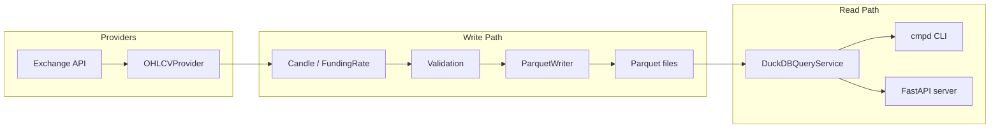

<div align="center">

# Crypto Market Data Platform

[](https://github.com/bigmikecreates/crypto-market-data-platform/actions/workflows/ci.yml)
[](https://codecov.io/github/bigmikecreates/crypto-market-data-platform)
[](https://bigmikecreates.github.io/crypto-market-data-platform/)

A pipeline for ingesting, validating, storing, and querying cryptocurrency market data. Exchange API responses are mapped to typed records, validated at explicit service boundaries, persisted as partitioned Parquet files, and exposed through a CLI and a REST API.

</div>

---

## How it works



All numeric fields (`open`, `high`, `low`, `close`, `volume`) are stored as strings in the model layer and cast to `decimal128(38,10)` at write time via PyArrow's C++ `.cast()` kernel. Parquet files are the interchange format: portable, queryable by DuckDB without import, and readable by any Parquet-compatible tool.

---

## Quickstart

```bash
pip install -e .

# Fetch one candle from the built-in FakeProvider
cmpd fetch \
  --mdt ohlcv \
  --symbol "BTC/USDT" \
  --timeframe 1h \
  --start 2026-01-01 \
  --end 2026-01-02 \
  --provider fake

# Inspect what was written
cmpd inspect --path data --limit 5

# Query it back
cmpd query ohlcv --symbol "BTC/USDT" --limit 5

# Start the REST API
cmpd serve --port 8000
```

For a full walkthrough — live providers, concurrent symbol ingestion, the query API — see **[Getting Started](https://bigmikecreates.github.io/crypto-market-data-platform/getting-started/)**.

---

## Providers

| Provider | Symbol format | Notes |
|---|---|---|
| `fake` | Any | Synthetic candles, no network access. Use for pipeline testing. |
| `bitfinex` | `tBTCUSD` | 10,000-candle batch limit, non-standard field order. |
| `bitstamp` | `btcusd` | Dict-based response format. |
| `kucoin` | `BTC-USDT` | 1,500-candle server limit, second-precision timestamps. |
| `bybit` | `BTCUSDT` | Category-based dispatch (spot), descending sort order. |
| `mexc` | `BTCUSDT` | Standard field order, 500-candle limit. |

Each provider implements the `OHLCVProvider` or `FundingRateProvider` ABC. Adding a new exchange means implementing one method — no consumer code changes.

---

## CLI reference

| Command | Description |
|---|---|
| `fetch` | Ingest OHLCV or funding-rate data. Accepts multiple `--symbol` values with `--workers N` for concurrent fetches. |
| `datasets` | List all available Parquet datasets under the data directory. |
| `inspect` | Print schema, row count, and sample rows from a Parquet file or directory. |
| `query ohlcv` | Query candle data with exchange, symbol, timeframe, and time-range filters. |
| `query funding-rate` | Query funding rate data with filters. |
| `query sql` | Run raw `SELECT` SQL via DuckDB over stored Parquet files. |
| `serve` | Start the FastAPI REST server. |

→ Full option reference: [CLI Reference](https://bigmikecreates.github.io/crypto-market-data-platform/reference/cli/)

---

## Key design decisions

**Strings-first data model.** `Candle` and `FundingRate` store all numeric fields as `str`. This saves ~68% per-candle memory versus `Decimal`, keeps providers free of type-import dependencies, and allows regex-based validation to run without allocating intermediate objects. Conversion to `decimal128(38,10)` happens once at the storage boundary via a vectorised C++ cast.

**Row-level upsert merge.** Re-fetching an overlapping time range never produces duplicates. Each row is identified by its merge key (`exchange`, `symbol`, `timeframe`, `source`, `timestamp`). Two strategies are dispatched automatically: a Python `dict`-based merge for partitions under 50,000 rows, and a DuckDB `NOT EXISTS` SQL anti-join for larger partitions.

**Validation blocks writes.** `validate_candle_batch()` evaluates five provider-independent rules across the full batch and returns a `ValidationResult`. If `passed` is `False`, the service raises `ValueError` before calling the writer — no partial writes.

**`QueryService` ABC.** Both the CLI and the FastAPI server depend on the `QueryService` interface, not the DuckDB implementation. Swapping the query engine requires only a new concrete class.

---

## Development

```bash
pip install -e ".[test,lint]"

pytest                          # run all tests
ruff check src/ tests/          # lint
ruff format src/ tests/         # format
mypy src/                       # type check

# Benchmark the I/O pipeline (synthetic, CPU-bound)
python scripts/benchmark_pipeline.py run --count 10000 --iterations 10

# Profile a live provider (network-bound)
python scripts/benchmark_pipeline.py profile \
  --start 2026-05-01 --end 2026-05-02

# Docker
docker build -t cmpd .
docker run -p 8000:8000 -v ./data:/app/data cmpd
```

---

## Documentation

Full documentation: **[bigmikecreates.github.io/crypto-market-data-platform](https://bigmikecreates.github.io/crypto-market-data-platform/)**

| Section | Contents |
|---|---|
| [Getting Started](https://bigmikecreates.github.io/crypto-market-data-platform/getting-started/) | Install, first fetch, live providers, concurrent ingestion |
| [Architecture](https://bigmikecreates.github.io/crypto-market-data-platform/architecture/) | Write/read path layers, design decisions |
| [Data Model](https://bigmikecreates.github.io/crypto-market-data-platform/data-model/) | `Candle` and `FundingRate` schema; why strings |
| [Validation Strategy](https://bigmikecreates.github.io/crypto-market-data-platform/validation-strategy/) | Rule set, `ValidationResult`, blocking behaviour |
| [Storage: Write Path](https://bigmikecreates.github.io/crypto-market-data-platform/storage-e2e/) | Stage-by-stage write pipeline, merge strategies |
| [Benchmark Design](https://bigmikecreates.github.io/crypto-market-data-platform/benchmark-design/) | Measurement methodology, CPU vs network profiling |
| [Performance Notes](https://bigmikecreates.github.io/crypto-market-data-platform/performance-notes/) | Measured baselines, provider profiles |
