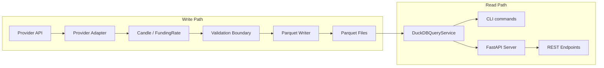

# Architecture

## Layers

The platform is organised as a linear pipeline with a read-side overlay:



### Write path

1. **Provider** — an exchange-specific adapter implementing `MarketDataProvider`
   (`providers/base.py`). Returns `list[Candle]` from raw API responses.
2. **Model** — `Candle` or `FundingRate` dataclass with all-string fields
   (`models/`).
3. **Validation** — `validate_candle_batch()` runs 5+ provider-independent
   checks without creating `Decimal` objects (`validation/candles.py`).
4. **Storage** — `write_candles()` converts strings to `decimal128(38,10)` via
   PyArrow C++ `.cast()` and writes partitioned Parquet files
   (`storage/parquet_writer.py`).

### Read path

1. **DuckDBQueryService** — implements `QueryService` ABC, reads Parquet in
   place via `read_parquet()` (`query/duckdb_service.py`).
2. **CLI** — `cmpd` Typer app with 7 commands (`cli/main.py`).
3. **Server** — `create_app()` FastAPI factory wrapping the `QueryService` ABC
   (`server/app.py`).

## Key Design Decisions

### Fixed `decimal128(38,10)` schema

All numeric columns use `decimal128(38,10)` regardless of ticker or price
range. `decimal128` is always 16 bytes — there is no storage benefit to
narrower types, and a fixed schema guarantees that DuckDB `UNION` queries
across tickers never hit type mismatches.

### Path-based file discovery

Parquet files are organised as:

```
data/{exchange}/{symbol}/{timeframe}/{date}.parquet
data/{exchange}/{symbol}/funding_rate/{date}.parquet
```

Because symbols can contain `/` (e.g. `BTC/USDT`), the discovery algorithm
uses the penultimate directory component as an anchor — if it is a timeframe
(e.g. `1h`) the dataset is candles; if it is `funding_rate`, it is funding
rates. This makes discovery depth-independent.

### Connection-per-query DuckDB usage

DuckDB connects, executes, and closes per query. This is cheap for an
in-process engine and eliminates connection-pool state management. The Parquet
schema is read at query time, so schema changes are automatically picked up.

### Four validation boundaries

1. **Provider** — raw response → `Candle` objects
2. **Service** — `Candle` batch → validated batch
3. **Storage** — validated batch → Parquet table/file
4. **Query** — stored dataset → user/API result

Each boundary has a single responsibility. When a bug surfaces, you know which
gate should have caught it.

## What exists now vs planned

| Component | Status |
|-----------|--------|
| `Candle` / `FundingRate` models | Stable |
| `FakeProvider` | Stable |
| `BitfinexProvider` | Stable |
| `KuCoinProvider` | Stable |
| `BybitProvider` | Planned (#2) |
| `KrakenProvider` | Planned (#3) |
| Validation (candles) | Stable |
| Validation (funding rates) | Stable |
| Parquet writer | Stable |
| `DuckDBQueryService` | Stable |
| FastAPI server | Stable |
| Benchmark pipeline | Stable |
| Provider profiling | Stable |
| CI workflow | Planned |
