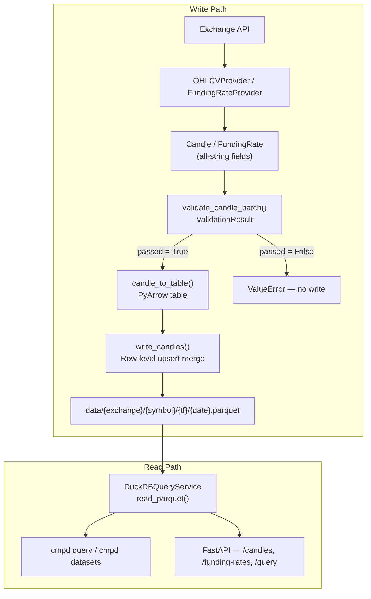

# Architecture

The platform is organised as a write path (provider → validation → storage) and a read path (storage → query → CLI/API). Both paths share the same Parquet files as the data layer. There is no separate database — DuckDB reads the files in place via `read_parquet`.

## Layer diagram

## Write path

### 1. Provider (`providers/`)

Provider adapters implement `OHLCVProvider` (for candle data) or `FundingRateProvider` (for funding rates). Each adapter is responsible for exchange-specific concerns: URL construction, authentication headers, pagination, rate-limit handling, field ordering, and timestamp semantics. The adapter maps each raw JSON row to a `Candle` or `FundingRate` dataclass with all fields assigned as Python strings.

No type coercion occurs at the provider boundary. This isolates schema decisions to the storage boundary and allows providers to be written without importing PyArrow or defining Parquet types.

### 2. Models (`models/`)

`Candle` and `FundingRate` are `@dataclass(slots=True)` with all fields typed as `str`. Slots eliminate the per-instance `__dict__` overhead — relevant when holding thousands of candles in memory during a paginated ingestion run.

All numeric fields (`open`, `high`, `low`, `close`, `volume`, `rate`, etc.) remain strings until the storage boundary. This allows regex-based validation to operate on the string directly without allocating intermediate `Decimal` objects.

### 3. Validation (`validation/`)

`validate_candle_batch()` runs five provider-independent rules over the full list of candles and returns a `ValidationResult`. If `passed` is `False`, the ingestion service raises `ValueError` and the writer is not called. The Parquet file is either untouched or not created.

Rules: `EMPTY_FIELD`, `INVALID_DECIMAL`, `INVALID_TIMESTAMP`, `OHLC_INVARIANT`, `DUPLICATE_TIMESTAMP`.

→ See [Validation Strategy](validation-strategy.md).

### 4. Storage (`storage/`)

`write_candles()` groups candles by target partition path, converts each group to a PyArrow table via `candle_to_table()`, and writes SNAPPY-compressed Parquet files. The conversion casts string fields to `decimal128(38,10)` for OHLCV columns and `timestamp[s]` for the timestamp column using PyArrow's C++ `.cast()` kernel.

When a target partition already exists, the writer performs a row-level upsert merge using either a Python `dict`-based strategy (< 50,000 rows) or a DuckDB `NOT EXISTS` SQL strategy (>= 50,000 rows).

→ See [Storage: Write Path](storage-e2e.md).

## Read path

### 5. Query service (`query/`)

`DuckDBQueryService` implements the `QueryService` ABC. All query methods open a DuckDB in-process connection, execute a `read_parquet(glob)` query with appropriate filters and casts, and close the connection. Connection-per-query eliminates connection pool state and means schema changes in Parquet files are picked up automatically.

The `QueryService` ABC has five methods: `list_datasets`, `get_candles`, `get_funding_rates`, `get_summary`, and `raw_sql`. The CLI and FastAPI server both depend on the ABC, not the DuckDB implementation — swapping the query engine requires only a new concrete class and a wiring change.

### 6. CLI (`cli/`)

`cmpd` is a Typer application with commands: `fetch`, `datasets`, `inspect`, `query ohlcv`, `query funding-rate`, `query sql`, and `serve`. The `fetch` command accepts multiple `--symbol` values and dispatches concurrent fetches via `ThreadPoolExecutor`.

### 7. Server (`server/`)

`create_app()` returns a FastAPI application configured with `CORSMiddleware` and a global exception handler that returns JSON error responses. The application holds a `ServerConfig` with an injected `QueryService` instance (default: `DuckDBQueryService`). All query logic runs through the injected service — the API layer contains no query implementation.

## Key design decisions

### Fixed `decimal128(38, 10)` across all tickers

`decimal128` is always 16 bytes in Parquet regardless of precision or scale. A fixed schema means DuckDB `UNION` queries across tickers never encounter type mismatches, and the storage boundary has a single type decision to enforce.

### Path-based file discovery with variable-depth symbol paths

Symbols containing `/` (e.g. `BTC/USDT`) create multi-level directory paths. The discovery algorithm uses the penultimate directory component as the dataset-type anchor: a timeframe string (e.g. `1h`) identifies a candle dataset; `funding_rate` identifies a funding rate dataset. This avoids special-casing symbol depth.

### Connection-per-query DuckDB

DuckDB in-process connections are cheap to open and close. Connection-per-query eliminates connection pool state, avoids stale prepared statement issues, and allows Parquet schema changes to be reflected immediately.

### Dependency inversion at every boundary

| Boundary | ABC | Concrete implementations |
|---|---|---|
| Provider | `OHLCVProvider`, `FundingRateProvider` | `FakeProvider`, `BitfinexProvider`, `KuCoinProvider`, … |
| Query | `QueryService` | `DuckDBQueryService` |
| Server | `QueryService` (injected via `ServerConfig`) | FastAPI wraps the ABC |

Adding a provider means implementing the ABC. Adding a query engine means implementing `QueryService`. No consumer code changes.
