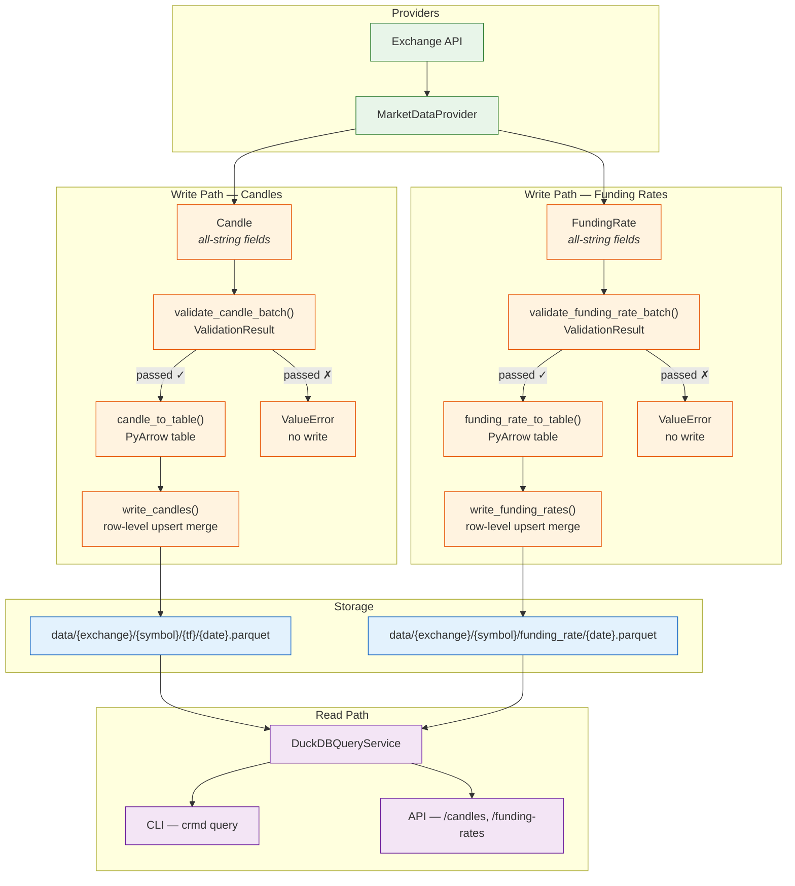

# CrMD Platform

A local-first pipeline for ingesting, validating, storing, and querying cryptocurrency market data. Exchange API responses are mapped to `Candle` and `FundingRate` records, validated at explicit system boundaries, persisted as partitioned Parquet files, and exposed through a Typer CLI and a FastAPI REST server.

## System overview



## Getting started

Install the package and run your first ingestion against the built-in `FakeProvider`:

```bash
pip install -e .

crmd fetch \
  --mdt ohlcv \
  --symbol "BTC/USDT" \
  --timeframe 1h \
  --start 2026-01-01 \
  --end 2026-01-02 \
  --provider fake

# Wrote 1 candle(s) for BTC/USDT to data/
```

Then inspect what was written and query it back:

```bash
crmd inspect --path data --limit 3

crmd query ohlcv --symbol "BTC/USDT" --limit 5
```

For a complete walkthrough — multiple providers, concurrent symbol ingestion, the REST API — see [Getting Started](getting-started.md).

## Design boundaries

| Boundary | What it enforces |
|---|---|
| Provider | Raw API response → typed `Candle` / `FundingRate` with all-string fields |
| Service | Batch validation (format, OHLC invariants, duplicates) — blocks write on failure |
| Storage | String → `decimal128(38,10)` cast, row-level upsert merge, Parquet write |
| Query | `read_parquet` via DuckDB, schema normalisation, result pagination |

## Current status

Core ingestion and query paths are stable. Providers: Bitfinex, KuCoin, Bybit, MEXC, Bitstamp, FakeProvider. The benchmark framework is feature-complete.

## Navigation

| Section | Purpose |
|---|---|
| [Getting Started](getting-started.md) | End-to-end walkthrough for new users |
| [Architecture](architecture.md) | Layer responsibilities and key design decisions |
| [Data Model](data-model.md) | `Candle` and `FundingRate` schema; why strings |
| [Providers](providers.md) | Supported exchanges, symbol mappings, adding new providers |
| [Validation Strategy](validation-strategy.md) | Validation boundaries and rule set |
| [Storage: Write Path](storage-e2e.md) | Stage-by-stage write pipeline |
| [Benchmarking](benchmark-design.md) | How the benchmark works, baseline metrics, and provider profiles |
