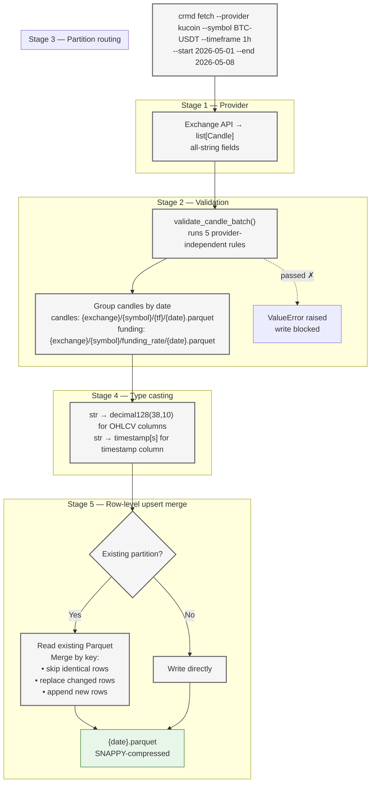
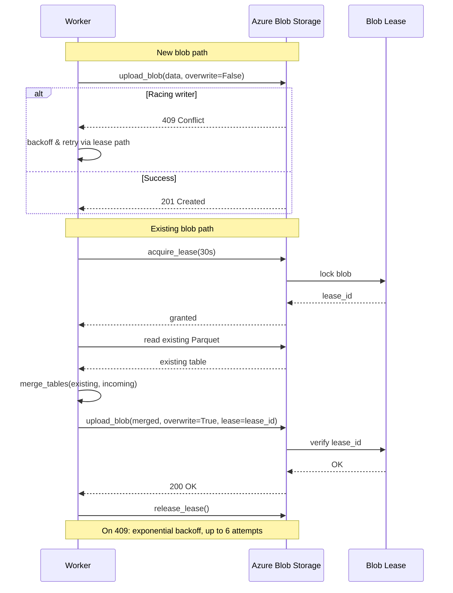
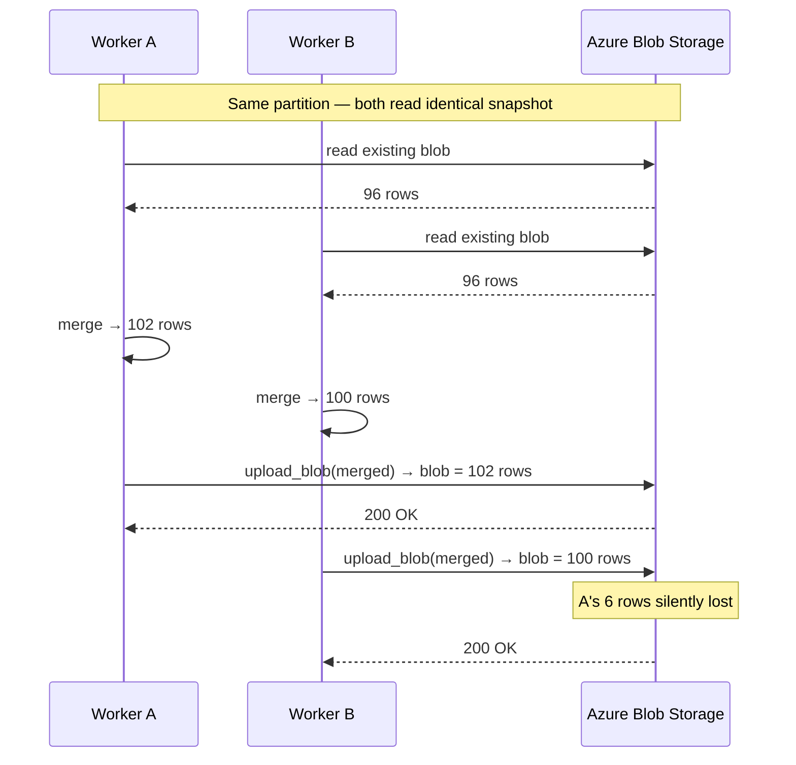
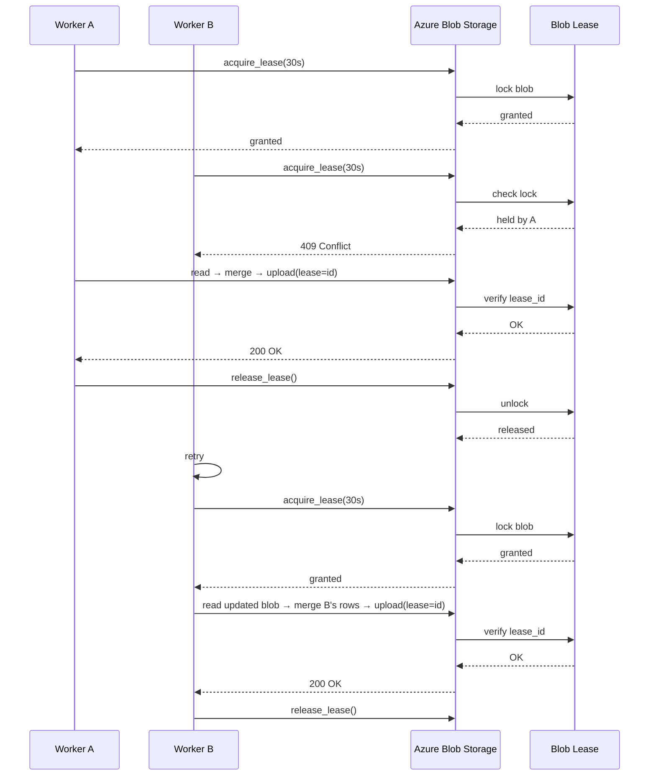

# Storage: Write Path

The write path converts a list of `Candle` or `FundingRate` records into partitioned Parquet files on disk. It executes five sequential stages for each ingestion call.

## Pipeline



---

## Stage 1 — Provider

Each provider adapter implements the `OHLCVProvider` or `FundingRateProvider` interface and absorbs exchange-specific differences: URL construction, field ordering, pagination, rate limits, and symbol naming conventions. The adapter maps each raw JSON row to a `Candle` or `FundingRate` dataclass with all fields assigned as strings.

No type coercion occurs at the provider boundary. This keeps provider adapters stateless and free of schema decisions — the storage boundary owns the Parquet type mapping.

→ See `OHLCVProvider` in the [Python API Reference](/crypto-market-data-platform/reference/#/python-api) for the method signature.

---

## Stage 2 — Validation

`validate_candle_batch()` evaluates five provider-independent rules across the full batch and returns a `ValidationResult`. If `passed` is `False`, the service layer raises `ValueError` and the writer is not called.

The write is blocked entirely on validation failure. No partial writes occur — the Parquet file is either untouched (if the partition already existed) or not created.

→ See [Validation Strategy](validation-strategy.md) for the full rule set, blocking behaviour, and design rationale.

---

## Stage 3 — Partition routing

Each candle is routed to a file based on its timestamp date:

```
data/{exchange}/{symbol}/{timeframe}/{YYYY-MM-DD}.parquet
```

Symbols containing `/` (e.g. `BTC/USDT`) are preserved in the path, creating a two-level symbol directory. The file discovery algorithm uses the penultimate directory component as the dataset-type anchor: if it matches a known timeframe (e.g. `1h`, `1d`), the dataset is candles; if it is `funding_rate`, it is funding rates.

Candles from the same batch are grouped by target path. Each partition is processed independently.

→ See [Parquet Schema Reference](/crypto-market-data-platform/reference/#/parquet-schema) for the exact partition layout.

---

## Stage 4 — Type casting

`candle_to_table()` converts a group of same-partition candles into a PyArrow table. String fields (`exchange`, `symbol`, `timeframe`, `source`) remain as dictionary-encoded strings. Numeric fields are cast via PyArrow's C++ `.cast()` kernel:

| Column | Parquet type |
|---|---|
| `open`, `high`, `low`, `close`, `volume` | `decimal128(38, 10)` |
| `timestamp` | `timestamp[s]` (or `timestamp[us]` per `TimestampConfig`) |
| `exchange`, `symbol`, `timeframe`, `source` | `string` (dictionary-encoded) |

**Why `decimal128(38, 10)`?**
`decimal128` is always 16 bytes regardless of precision or scale. A fixed schema across all tickers guarantees that DuckDB `UNION` queries never encounter type mismatches. The 38-digit precision with 10 fractional digits covers all realistic cryptocurrency prices.

**Why cast at the storage boundary, not in the provider?**
The storage boundary is the single authority on Parquet type decisions. Changing a column type requires modifying one function (`candle_to_table`) rather than each provider adapter.

→ See `candle_to_table()` in the [Python API Reference](/crypto-market-data-platform/reference/#/python-api) for the exact function signature.

---

## Stage 5 — Row-level upsert merge

When a target partition file already exists, the writer merges incoming records against the existing rows.

### Merge key

The row identity key for candles:

```
(exchange, symbol, timeframe, source, timestamp)
```

For funding rates:

```
(exchange, symbol, source, timestamp)
```

### Merge behaviour

For each partition that already has a file on disk:

1. Read the existing Parquet file into an Arrow table
2. For matching keys: replace the existing row with the incoming row (handles corrected values from the provider)
3. For unmatched incoming keys: append as new rows
4. Discard incoming rows whose key and all values are identical to the existing row

The result is written back to the same path, replacing the previous file.

### Merge strategies

| Strategy | Mechanism | Threshold |
|---|---|---|
| `memory` | Python `dict`-based key index; linear scan over existing rows | < 50,000 existing rows |
| `duckdb` | SQL `NOT EXISTS` anti-join via DuckDB: `SELECT e.* FROM existing e WHERE NOT EXISTS (SELECT 1 FROM incoming i WHERE <key match>) UNION ALL SELECT * FROM incoming` | >= 50,000 existing rows |
| `auto` | Dispatches to `memory` below threshold, `duckdb` above | Default |

The `duckdb` strategy avoids loading the full existing partition into a Python dict. For partitions with years of historical data, the `NOT EXISTS` anti-join keeps the working set inside DuckDB's engine.

### Properties

- **Idempotent:** fetching the same date range twice produces identical Parquet files.
- **Self-healing:** a corrected value from the provider replaces the stored row on the next fetch.
- **Append-safe:** new rows are added without affecting rows not present in the incoming batch.

→ See `write_candles()` and merge function signatures in the [Python API Reference](/crypto-market-data-platform/reference/#/python-api).

---

## Azure Blob Storage variant

When `base_path` starts with `az://` or `abfs://`, all five stages run identically except Stages 3 and 5, which are replaced by cloud-aware equivalents.

**Stage 3 (cloud) — URI routing**

Partition paths are built as plain strings rather than `pathlib.Path` objects. POSIX path normalisation silently collapses `az://` to `az:/`, so URI construction never goes through `Path`:

```
az://mycontainer/data/{exchange}/{symbol}/{timeframe}/{YYYY-MM-DD}.parquet
```

**Stage 5 (cloud) — Lease-protected upsert**

The merge is wrapped in `azure_lease_write()`, which serialises concurrent writers at the blob level using Azure Blob Storage leases.



The 30-second lease duration is enough for the read-merge-write cycle to complete under load, and short enough that a crashed worker unblocks others automatically when the lease expires.

→ See [Concurrency](#concurrency) below for a detailed walkthrough of the race conditions this prevents.

---

## Concurrency

### Local storage

No concurrency control is needed for local deployments. The CLI's `--workers` flag parallelises by symbol — each symbol maps to a distinct set of partition files. Two workers never write to the same file simultaneously.

### Azure Blob Storage

**What happens without locking:**

Two workers targeting the same partition (same exchange, symbol, timeframe, and date) both read the existing blob, compute their merged tables independently, then race to write back. The last writer wins and silently discards the other's rows.



**What happens with `azure_lease_write`:**



Result: all rows from both workers are present in the final blob.

**Scope of the guarantee:**

Workers writing to *different* partitions are unaffected — each blob is an independent Azure object. The lease only matters when two workers happen to write to the same partition simultaneously, which in practice happens when:

- Backfilling overlapping date ranges for the same symbol across workers
- Re-running a failed ingestion while another run is still in progress

The `--workers` flag on `crmd fetch` parallelises by symbol, so a single `fetch` invocation does not produce same-partition conflicts. The lease matters most when multiple independent `fetch` processes run against the same Azure container.

---

## Funding rate variant

Funding rates follow the same five stages. The partition path omits the timeframe component:

```
data/{exchange}/{symbol}/funding_rate/{YYYY-MM-DD}.parquet
```

The merge key uses `(exchange, symbol, source, timestamp)`.

→ See [Parquet Schema Reference](/crypto-market-data-platform/reference/#/parquet-schema) for the full column set and partition layout.
